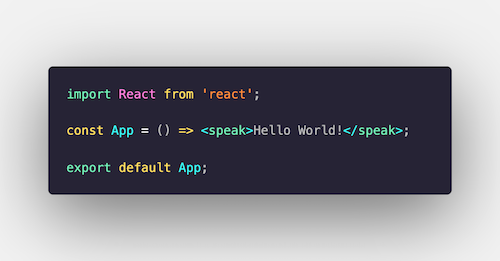

<h1 align="center">
  ReactSSML
</h1>
<div align="center">
  
</div>

## 🌟 Quick Start

Get the source code

```bash
git clone https://github.com/andrelandgraf/react-ssml-dom.git
```

Build the demo

```bash
npm run build
```

Run the demo 

```bash
npm run start:demo

> react-ssml@1.0.0 start:demo /Users/anlandg/workspaces/react-ssml
> node dist/main.js

Express backend listening on port 8888! 🚀
```

***Express server is now running on port 8888!***

Use Postman or a tool of your choice to hit the fulfillment endpoint.

```bash
curl -X POST http://localhost:8080/api/login/
```

And there we go!

```json
{
  "reply": "<speak> <audio src=\"https://s3-bucket.com/mock-song.ogg\">  Oh, I am sorry, this file seems not to work, please try another song</audio> </speak>"
}
```

## 🔍 How it works 

This project is using `react-reconciler` to implement a custom renderer for React.

See: `./src/ReactSSML.js` which replaces `react-dom`

On top of that this project implements a (proof-of-concept) version of the web's DOM for SSML.

See: `./src/ssml-dom/*`

The demo folder contains a demo React App. The demo express server runes via `.index.js`

Set `receivedError` in `./demo/Reply.jsx` to `true` and see how the response SSML changes.

Also, try to set the timeout time in `./demo/Reply.jsx` from `3000` to `8000` which is higher as our global timeout in `index.js`. See what happens to get an idea of how this project works.